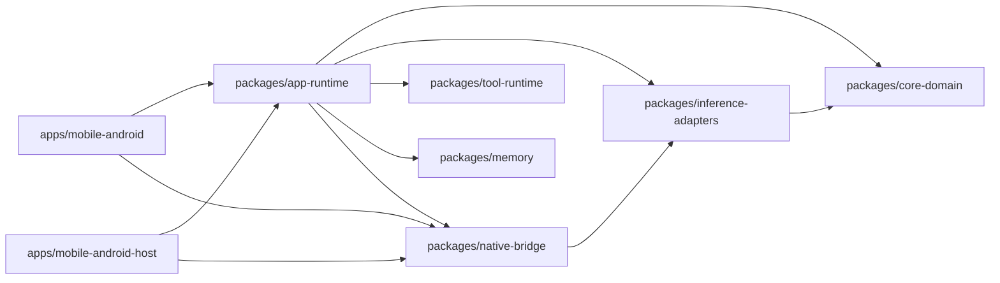
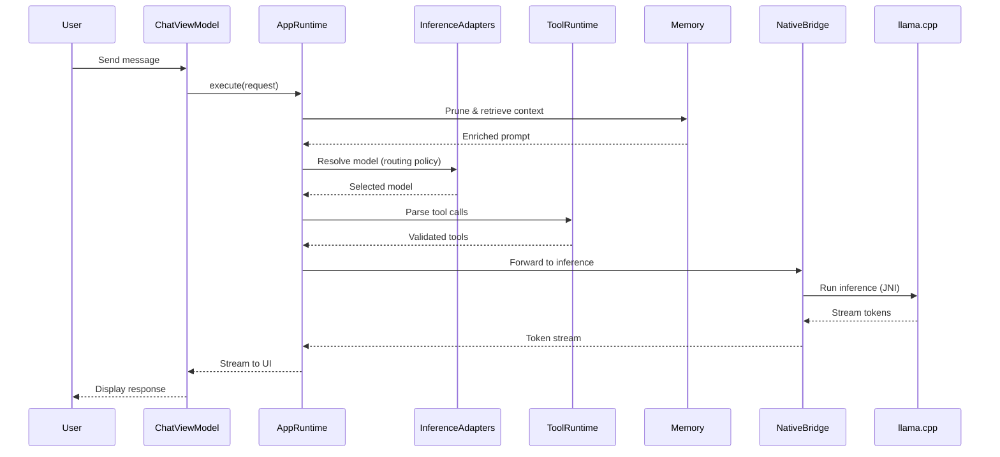

# PocketAgent

Offline, privacy-first AI assistant for Android — runs large language models directly on your phone.

## Features

- **Offline-first** — all AI processing happens locally, no cloud dependencies
- **Streaming responses** — real-time token-by-token display
- **Model routing** — automatic model selection based on device state (0.8B/2B)
- **Performance profiles** — BALANCED / FAST / BATTERY modes
- **GPU acceleration** — OpenCL/Hexagon backend support
- **Local tools** — date/time, notes lookup, web search
- **Memory** — persistent context across sessions
- **Image Q&A** — vision-capable multimodal inference

## Tech Stack

| Layer | Technology |
|-------|------------|
| UI | Jetpack Compose, Kotlin |
| Runtime | llama.cpp (JNI) |
| Architecture | Modular monolith (KMP) |
| Testing | Maestro, JUnit, Kotest |

## Supported Models

- Qwen2.5-0.5B / 0.8B / 2B (Q4_K_M, Q8_0)
- SmolLM2-135M / 360M / 1.7B
- Phi3.5-mini-instruct
- Gemma 2 2B

## Quick Start

```bash
# Clone and enter directory
git clone https://github.com/your-org/pocket-gpt.git
cd pocket-gpt

# Run tests
./gradlew test

# Build debug APK
./gradlew :apps/mobile-android:assembleDebug
```

**Requirements:** Android SDK 34+, Kotlin 1.9+, JDK 17+

For full setup including device testing, see [scripts/dev/README.md](scripts/dev/README.md).

## Architecture

### Module Dependency Graph



### Request Flow

When a user sends a message:



### Key Responsibilities

| Module | Responsibility |
|--------|----------------|
| `core-domain` | Domain models, interfaces, contracts |
| `inference-adapters` | Model selection policy, runtime abstraction |
| `tool-runtime` | Tool schema validation, execution |
| `memory` | Context pruning, retrieval, persistence |
| `native-bridge` | JNI bindings to llama.cpp |
| `app-runtime` | Orchestration, startup guards, benchmarks |
| `mobile-android` | Compose UI, ViewModels, Android integration |

## Directory Layout

| Path | Purpose |
|------|---------|
| `apps/mobile-android/` | Android app module |
| `apps/mobile-android-host/` | Host/JVM smoke tests |
| `packages/app-runtime/` | Orchestration layer |
| `packages/native-bridge/` | JNI + llama.cpp runtime |
| `packages/core-domain/` | Shared domain contracts |
| `packages/tool-runtime/` | Local tool execution |
| `packages/memory/` | Memory & retrieval |
| `scripts/dev/` | Dev/test entrypoints |
| `tests/maestro/` | E2E mobile flows |

## Contributing

Contributions are welcome. Please ensure tests pass before submitting PRs:

```bash
# Run unit tests
bash scripts/dev/test.sh fast

# Run full test suite
bash scripts/dev/test.sh merge
```

## License

MIT License — see LICENSE file (to be added).

---

For detailed documentation, see [`docs/`](docs/).
