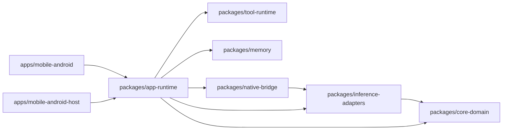

# PocketAgent

Foundation repository for an offline, privacy-first mobile AI product.

## Source of truth

- Dev/test commands: `scripts/dev/README.md`
  - Newcomer quick path: `scripts/dev/README.md#newcomer-confidence-checklist-4-commands`
- Test strategy + release gates: `docs/testing/test-strategy.md`
- Android device execution details: `docs/testing/android-dx-and-test-playbook.md`
- Execution status board: `docs/operations/execution-board.md`

## Layout

- `docs/`: product, architecture, feasibility, security, and roadmap docs
- `docs/ux/`: onboarding, user journey, model UX, and listing specs
- `apps/mobile-android/`: Android app module (`test` + `androidTest` lanes)
- `apps/mobile-android-host/`: host/JVM smoke lane for fast iteration
- `packages/core-domain/`: shared product/domain logic contracts
- `packages/inference-adapters/`: runtime adapter interfaces and policy routing
- `packages/tool-runtime/`: local tool execution and schema validation contracts
- `packages/memory/`: memory and retrieval contracts
- `packages/native-bridge/`: JNI + ADB runtime bridge and inference runtime adapter
- `packages/app-runtime/`: orchestration layer (runtime facade, startup guards, benchmark harness)
- `scripts/benchmarks/`: benchmark harness docs and scripts
- `scripts/dev/`: canonical test/dev entrypoints
- `tools/devctl/`: config-driven lane orchestrator backing `scripts/dev/*`
- `config/devctl/`: lane/device/stage2 manifests for orchestrator behavior
- `tests/maestro/`: mobile E2E flow assets

## Module dependency graph

