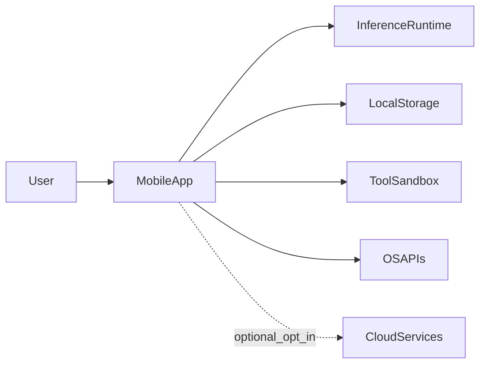

# System Context

## Product Context

PocketAgent is a local-first mobile assistant that provides text and image understanding while preserving user privacy by default.

## Operating Constraints

1. Devices span low, mid, and high memory/compute tiers.
2. Battery and thermal limits directly affect usable session length.
3. Network availability is not guaranteed.
4. Any privacy claim must be verifiable in code and user-visible settings.

## Context Diagram

## Data Boundaries

1. Conversation content is stored locally.
2. Model inference is local by default.
3. Tool calls are validated and executed in a bounded local sandbox.
4. Optional cloud operations require explicit user opt-in.

## Quality Attributes

1. Reliability over peak benchmark numbers
2. Predictable latency under sustained load
3. Privacy by default with explicit controls
4. Modular internals enabling future extraction
