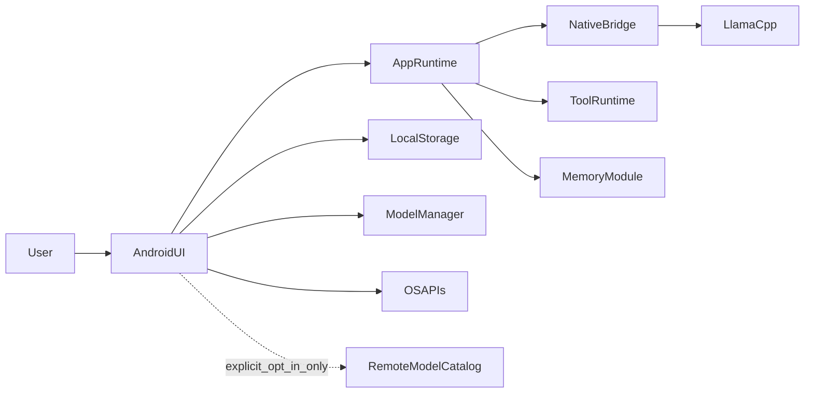

# System Context

Last updated: 2026-03-08

## Product Context

PocketAgent is a local-first Android assistant that runs text, tool, and image workflows on-device by default.

## Operating Constraints

1. Device classes vary widely in RAM, thermals, and sustained performance.
2. Network availability is optional; core workflows must still function offline.
3. Privacy/security claims must map directly to implemented runtime and UI behavior.
4. Runtime startup and model provisioning failures must be recoverable in-app without shell access.

## Runtime Context Diagram

## Data and Trust Boundaries

1. Conversation/session state is persisted locally on device.
2. Model payloads are verified (checksum and compatibility hard gates) before activation.
3. Tool execution is allowlisted and schema-validated before dispatch.
4. Optional remote manifest fetch is additive; bundled catalog fallback remains available.
5. Diagnostics export is local and redaction-aware.

## Quality Attributes

1. Deterministic recovery over hidden fallback behavior.
2. Stable runtime startup/send semantics over benchmark-only optimization.
3. Explicit runtime/backend transparency for QA/support triage.
4. Modular boundaries that support refactoring without distributed-system overhead.
