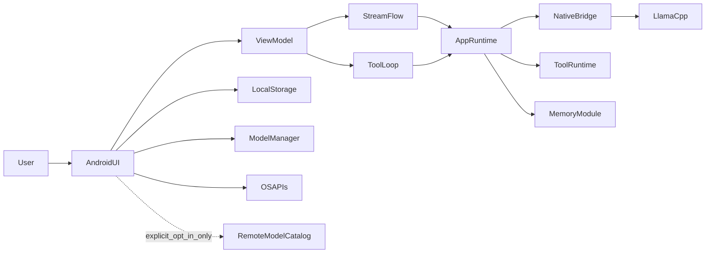

# System Context

Last updated: 2026-03-10

## Product Context

PocketAgent is a local-first Android assistant that runs text, tool, and image workflows on-device by default.

## Operating Constraints

1. Device classes vary widely in RAM, thermals, and sustained performance.
2. Network availability is optional; core workflows must still function offline.
3. Privacy/security claims must map directly to implemented runtime and UI behavior.
4. Runtime startup and model provisioning failures must be recoverable in-app without shell access.

## Runtime Context Diagram

## Streaming Contract (Current)

1. UI send path builds `StreamChatRequestV2` with projected interaction transcript.
2. `previousResponseId` is populated from the latest assistant request id in the timeline and forwarded through runtime contracts.
3. Runtime emits phase-typed events:
   - `CHAT_START`
   - `MODEL_LOAD`
   - `PROMPT_PROCESSING`
   - `TOKEN_STREAM`
   - `CHAT_END`
   - `ERROR`
4. UI status copy is phase-driven (`Preparing request`, `Loading model`, `Prefill`, `Generating`, `Finalizing`, `Runtime error`).
5. Terminal stream outcomes are explicit: `Completed`, `Cancelled`, `Failed`.

## Android Runtime Mode Contract

1. Runtime mode is resolved by `POCKETGPT_ANDROID_RUNTIME_MODE` (`remote` or `in_process`).
2. Default mode is `in_process` for debug builds and `remote` for non-debug builds.
3. Backend labels surfaced in app/runtime include:
   - `NATIVE_JNI`
   - `REMOTE_ANDROID_SERVICE`
   - `ADB_FALLBACK`
   - `UNAVAILABLE`

## Interaction and Transcript Contract

1. Timeline messages are projected to `InteractionMessage` (`role`, `parts`, optional `toolCalls`, optional `toolCallId`, metadata).
2. The transcript path is first-class in app runtime and used as the source context for prompt rendering.
3. `previousResponseId` continuity metadata is currently carried through interfaces; local inference behavior remains transcript-driven.

## Data and Trust Boundaries

1. Conversation/session state is persisted locally on device.
2. Model payloads are verified (checksum and compatibility hard gates) before activation.
3. Tool execution is allowlisted and schema-validated before dispatch.
4. Optional remote manifest fetch is additive; bundled catalog fallback remains available.
5. Diagnostics export is local and redaction-aware.

## Quality Attributes

1. Deterministic recovery over hidden fallback behavior.
2. Stable runtime startup/send semantics over benchmark-only optimization.
3. Explicit runtime/backend transparency for QA/support triage.
4. Modular boundaries that support refactoring without distributed-system overhead.
