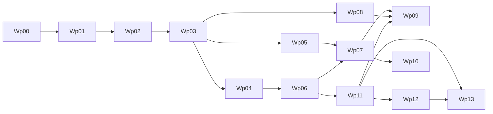

# Execution Board

Last updated: 2026-03-06

This is the single board for planning and delivery.  
All teams should update status here first, then mirror updates in role playbooks.

## Program Standard

Engineering and quality excellence are mandatory program-wide.

1. Task completion requires acceptance criteria, test proof, and evidence links.
2. Quality regressions discovered in-progress must be prioritized before new feature expansion.
3. Promotion decisions require both technical correctness and UX quality confidence.

## How To Use

1. Check task status (`Done`, `In Progress`, `Ready`, `Blocked`, `Backlog`).
2. Confirm prerequisites are complete.
3. Take only `Ready` tasks unless explicitly escalated.
4. Update owner and date whenever task status changes.

## Status Legend

- `Done`: completed with evidence and acceptance criteria met
- `In Progress`: currently being executed
- `Ready`: unblocked and queued
- `Blocked`: cannot proceed (list blocker)
- `Backlog`: not started and not yet ready

## Milestones and Work Packages

| ID | Work Package | Owner | Support | Order | Parallelizable | Prerequisites | Status | Target Window |
|---|---|---|---|---|---|---|---|---|
| WP-00 | Foundation docs and architecture baseline | Product | Eng, QA | 0 | No | none | Done | Complete |
| WP-01 | Build/CI baseline (wrapper, CI jobs, test command) | Engineering | QA | 1 | No | WP-00 | Done | Week 1 |
| WP-02 | Real Android runtime slice (`llama.cpp`) | Engineering | QA | 2 | No | WP-01 | Done | Week 1-2 |
| WP-03 | Artifact + benchmark reliability (A/B thresholds) | Engineering | QA, Product | 3 | Partial | WP-02 | Done | Week 2 |
| WP-04 | Routing, policy, diagnostics hardening | Engineering | Security, QA | 4 | Yes | WP-03 | Done | Week 3 |
| WP-05 | Tool runtime safety productionization | Engineering | Security, QA | 4 | Yes | WP-03 | Done | Week 3-4 |
| WP-06 | Memory + image productionization | Engineering | QA, Product | 5 | Partial | WP-04 | Done | Week 4-5 |
| WP-07 | Beta hardening and go/no-go packet | QA | Eng, Product | 6 | No | WP-05, WP-06 | Done | Week 6 |
| WP-08 | MVP positioning and launch prep assets | Marketing | Product | 5 | Yes | WP-03 | Done | Week 4-6 |
| WP-09 | Distribution plan and beta operations | Product | Marketing, QA | 7 | Yes | WP-07, WP-08, WP-11 | In Progress | Week 6-7 |
| WP-10 | Voice horizon discovery (STT/TTS spikes) | Engineering | Product, QA | 8 | Yes | WP-07 | Backlog | Post-MVP |
| WP-11 | Android MVP user experience (chat + session + image/tool UX) | Engineering | Product, QA, Design | 6 | Yes | WP-06 | Done | Week 6 |
| WP-12 | Backend production runtime closure (native inference, model distribution, Android-native data plane) | Engineering | QA, Product, Security | 7 | Yes | WP-07, WP-11 | Done | Week 7-8 |
| WP-13 | UX quality closure (onboarding, runtime clarity, usability gate, listing readiness) | Product | Eng, QA, Design, Marketing | 8 | Yes | WP-11 | In Progress | Week 8 |

## Current Release Policy (Locked)

1. Build policy: single build with download manager enabled by default.
2. Gate policy: `soft gate` for controlled pilot expansion only.
3. Promotion beyond pilot requires completed moderated WP-13 packet.
4. Launch claims must map to lane pass ids + evidence links.

## Current Sprint Board

### In Progress

- [ ] DOC-01 timeline/status reconciliation across roadmap + board + role playbooks
- [ ] DOC-02 product/UX doc parity sync for timeout/cancel/send-capture + manifest outage UX
- [ ] ENG-19 devctl preflight robustness for busy media paths (retry/fallback + `model-sync-v1` cross-launch cache contract landed; full rerun packet pending)
- [ ] ENG-20 runtime cancel/timeout contract hardening (JNI + fallback semantics + journey telemetry parity)
- [ ] WP-09 distribution plan and beta operations execution (kickoff note published)
- [ ] QA WP-09 weekly rollout quality execution support (templates delivered; cadence in progress)
- [ ] MKT-03 launch channel test plan draft finalization
- [ ] MKT-04 landing page + launch copy v1 prep draft
- [ ] PROD-04 monetization scope and pricing hypothesis kickoff (v0 doc published)
- [ ] DX-01 layered test profiles + Stage-2 quick/closure efficiency rollout
- [ ] DX-02 provider-style caching rollout (prefix/KV reuse + telemetry)
- [ ] WP-13 run-01 hold closure prep (moderated cohort scheduling + packet readiness)

### Ready

- [ ] UX-13 stuck send + timeout recovery UX spec and acceptance coverage
- [ ] QA-11 rerun `android-instrumented` + `maestro` + `journey` after ENG-19 and publish pass ids
- [ ] QA-13 send-capture gate operationalization in weekly regression workflow
- [ ] QA-WP13-RUN02 moderated 5-user usability run execution and packet completion
- [ ] SEC-02 privacy claim parity audit (claim -> control -> evidence mapping)
- [ ] PROD-11 pilot support + incident UX-ops playbook
- [ ] MKT-08 proof asset capture + Play Store shotlist finalization (`docs/ux/play-store-listing-spec.md`)
- [ ] MKT-09 first 7-day channel scorecard execution window
- [ ] MKT-10 claim freeze v1 (publishable vs internal-only claims tied to PROD-10 rows)
- [ ] PROD-10 launch gate matrix decision run (promote/hold memo)
- [ ] APP-STORE-01 Play Store listing spec + screenshot shotlist finalization (`docs/ux/play-store-listing-spec.md`)

### Done

- [x] WP-00 Foundation docs and architecture baseline
- [x] WP-01 Build/CI baseline
- [x] WP-02 Real Android runtime slice
- [x] QA-01 Stage 1 smoke loop on physical Android completed (`docs/operations/evidence/wp-02/2026-03-04-qa-01.md`)
- [x] WP-03 Artifact + benchmark reliability (A/B thresholds)
- [x] ENG-OPS Engineering foundations simplification (strict gates, single-source docs, Android module realignment scaffolding)
- [x] QA-02 Phase B: real Scenario A/B device run + threshold report + logcat evidence
- [x] ENG-04 closeout gate: artifact-manifest startup validation active, placeholder checksum removed from active Stage-2 path, and QA unblocked for final QA-02 rerun
- [x] QA-02 closeout rerun: artifact-validated Stage-2 Scenario A/B packet refreshed with threshold PASS + logcat (`docs/operations/evidence/wp-03/2026-03-04-qa-02-closeout.md`)
- [x] ENG-05 implementation scope landed: routing matrix tests, runtime policy enforcement checks, and diagnostics redaction checks (`docs/operations/evidence/wp-04/2026-03-04-eng-05.md`)
- [x] QA-03 routing/policy boundary regression rerun passed on incoming WP-04 state (`docs/operations/evidence/wp-04/2026-03-04-qa-03-rerun.md`)
- [x] QA-04 tool safety adversarial regression rerun passed on final WP-05 state (`docs/operations/evidence/wp-05/2026-03-04-qa-04-rerun.md`)
- [x] ENG-06 closeout gate: tool runtime schema safety productionization completed with package-level acceptance and deterministic error-contract stability checks (`docs/operations/evidence/wp-05/2026-03-04-eng-06-closeout.md`)
- [x] ENG-07 closeout gate: shared file-backed memory backend + retention/pruning tests + deterministic Scenario C image contract tests landed; QA-05 unblocked for device acceptance execution (`docs/operations/evidence/wp-06/2026-03-04-eng-07-closeout.md`)
- [x] QA-05 Scenario C image + memory acceptance packet executed and passed (`docs/operations/evidence/wp-06/2026-03-04-qa-05.md`)
- [x] ENG-08 closeout gate: runtime image flow integrated with routing/model lifecycle contracts plus deterministic image validation coverage (`docs/operations/evidence/wp-06/2026-03-04-eng-08.md`)
- [x] WP-06 package closeout complete (ENG-07 + ENG-08 + QA-05 evidence aligned)
- [x] WP-05 Tool runtime safety productionization package closeout complete
- [x] WP-04 package closeout complete (routing/policy/diagnostics hardening with engineering+QA evidence)
- [x] QA-06 30-minute soak and crash/OOM/ANR evidence pack executed and passed (`docs/operations/evidence/wp-07/2026-03-04-qa-06.md`)
- [x] WP-07 Engineering Stage-6 resilience support closeout landed (startup-check assessment + crash-recovery guard tests) (`docs/operations/evidence/wp-07/2026-03-04-eng-stage6-resilience-closeout.md`)
- [x] WP-07 package closeout complete (final Product/QA/Engineering dated signatures recorded) (`docs/operations/evidence/wp-07/2026-03-04-prod-03-final-signoff.md`)
- [x] WP-11 package closeout complete (`UI-01`..`UI-10` acceptance evidence validated on device + soak loop) (`docs/operations/evidence/wp-11/2026-03-04-qa-08-ui-gate-rerun.md`)
- [x] PROD-03 acceptance checklist finalization complete
- [x] WP-08 positioning and launch prep asset lock pass complete (`docs/operations/evidence/wp-08/2026-03-04-mkt-lock-pass.md`, `docs/operations/evidence/wp-08/2026-03-04-prod-lock-pass.md`)
- [x] ENG-11A runtime truth gate landed: startup checks classify `ADB_FALLBACK` as blocking for closure-path runs and publish backend identity in stage runner output (`docs/operations/evidence/wp-12/2026-03-04-eng-11-runtime-truth-gate.md`)
- [x] WP-12 handover ticket packet published for `ENG-12..ENG-17` and `QA-WP12` execution sequencing (`docs/operations/evidence/wp-12/2026-03-04-prod-wp12-handover-ticket-packet.md`)
- [x] ENG-12 model distribution implementation landed (side-load/manual-internal only + strict manifest/SHA/provenance/runtime verification hard-block policy) (`docs/operations/evidence/wp-12/2026-03-04-eng-12-model-distribution-implementation.md`)
- [x] ENG-14 Android-native runtime memory backend landed (JDBC-independent runtime path + parity tests) (`docs/operations/evidence/wp-12/2026-03-04-eng-14-android-native-memory.md`)
- [x] ENG-15 local tool data-store integration landed (`notes_lookup`/`local_search`/`reminder_create` no longer placeholder responses) (`docs/operations/evidence/wp-12/2026-03-04-eng-15-tool-store-integration.md`)
- [x] ENG-16 production runtime-backed image path landed (`SmokeImageInputModule` removed from production lane) (`docs/operations/evidence/wp-12/2026-03-04-eng-16-image-runtime-path.md`)
- [x] ENG-17 Android platform network policy wiring/regression checks landed (`docs/operations/evidence/wp-12/2026-03-04-eng-17-network-policy-wiring.md`)
- [x] ENG-13 native JNI runtime proof landed with full Samsung `NATIVE_JNI` 0.8B/2B scenario A/B + meminfo artifact chain (`docs/operations/evidence/wp-12/2026-03-04-eng-13-native-runtime-proof.md`)
- [x] QA-WP12 closeout validation packet rerun executed (recommendation: close WP-12) (`docs/operations/evidence/wp-12/2026-03-04-qa-wp12-closeout.md`)
- [x] ENG-13 rerun executed with fresh full closure artifact chain on Samsung (`NATIVE_JNI` 0.8B/2B A/B + runtime validator PASS; strict threshold gate remains a performance follow-up) (`docs/operations/evidence/wp-12/2026-03-05-eng-13-native-runtime-rerun.md`)
- [x] QA-WP12 rerun validated refreshed ENG-13 artifact chain and reconfirmed WP-12 close recommendation (`docs/operations/evidence/wp-12/2026-03-05-qa-wp12-closeout-rerun.md`)
- [x] PROD-WP12 final acceptance/signoff complete (`docs/operations/evidence/wp-12/2026-03-04-prod-wp12-final-signoff.md`)
- [x] WP-12 package closeout complete (ENG-12..ENG-17 + QA-WP12 evidence aligned)
- [x] TEST-ENG-01 test architecture and ownership matrix publish (`docs/testing/test-strategy.md`)
- [x] TEST-ENG-02 persistence codec unit coverage (`apps/mobile-android/src/test/kotlin/com/pocketagent/android/ui/state/SessionPersistenceCodecTest.kt`)
- [x] TEST-ENG-03 runtime facade delegation unit coverage (`apps/mobile-android/src/test/kotlin/com/pocketagent/android/ui/runtime/DefaultMvpRuntimeFacadeTest.kt`)
- [x] TEST-ENG-04 runtime benchmark runner unit coverage (`packages/app-runtime/src/commonTest/kotlin/com/pocketagent/runtime/StageBenchmarkRunnerTest.kt`)
- [x] TEST-ENG-05 instrumentation smoke extension for onboarding/runtime/privacy/NL tool flow (`apps/mobile-android/src/androidTest/kotlin/com/pocketagent/android/MainActivityUiSmokeTest.kt`)
- [x] ENG-P1 model manager phase-2 implemented (download/progress/retry/storage controls/versioned installs + manual activation policy) (`docs/operations/evidence/wp-13/2026-03-05-eng-p1-model-manager-phase2-closure.md`)
- [x] UX-P1 recovery copy refinement implemented for checksum/provenance/runtime-compatibility failures (`docs/ux/error-recovery-guide.md`, `docs/operations/evidence/wp-13/2026-03-05-eng-p1-model-manager-phase2-closure.md`)
- [x] UI-P1 NotReady/Error flow polish implemented (CTA hierarchy + transition feedback after import/download/refresh/activate) (`docs/operations/evidence/wp-13/2026-03-05-eng-p1-model-manager-phase2-closure.md`)
- [x] WP-13 wireless device lane rerun complete (`android-instrumented` + `maestro` + `journey` on attached wireless device) (`docs/operations/evidence/wp-13/2026-03-05-qa-wireless-lane-rerun.md`)
- [x] WP-13 rerun refresh after single-build download-manager de-gating (`android-instrumented` + `maestro` pass; Maestro Scenario A/B/C + activation smoke recovery assertions validated) (`docs/operations/evidence/wp-13/2026-03-05-qa-wireless-lane-rerun.md`)
- [x] ENG-21 interaction architecture refactor landed (typed interaction contract + template registry/renderer + inference executor + stream reducer + persistence backward compatibility) (`docs/operations/evidence/wp-13/2026-03-06-eng-interaction-contract-refactor.md`)
- [x] PROD-09 soft-gate pilot policy published (single-build default downloads, 25 testers/7 days, hard-stop and fallback rules) (`docs/operations/prod-09-soft-gate-pilot-policy.md`)
- [x] UX-12 recovery journey spec published (`NotReady -> setup -> Ready` with event schema + success targets) (`docs/ux/ux-12-recovery-journey-spec.md`)
- [x] TEST-QA-01 weekly UI regression matrix update with WP-13 UX extensions (`docs/testing/wp-09-ui-regression-matrix.md`)
- [x] TEST-QA-02 release-promotion checklist update with instrumentation/Maestro pass-id requirements (`docs/operations/evidence/wp-09/2026-03-04-qa-wp09-release-promotion-checklist.md`)
- [x] TEST-PROD-01 WP-13 usability gate packet operational template publication (`docs/operations/wp-13-usability-gate-packet-template.md`)
- [x] MKT-02 external competitor snapshot sourced (ChatGPT/Gemini/Claude) (`docs/operations/evidence/wp-08/2026-03-04-mkt-02-external-competitor-research.md`)
- [x] ENG-18 UI accessibility + error-state hardening complete (`docs/operations/evidence/wp-09/2026-03-04-eng-18-ui-accessibility-error-hardening.md`)
- [x] QA-10 weekly UI regression matrix run 01 complete (`docs/operations/evidence/wp-09/2026-03-04-qa-10-weekly-ui-regression-matrix-run-01.md`)
- [x] PROD-08 UX feedback taxonomy + intake policy complete (`docs/operations/evidence/wp-09/2026-03-04-prod-08-ux-feedback-taxonomy-pilot.md`)
- [x] MKT-07 UI proof-based messaging + asset-selection pass complete (`docs/operations/evidence/wp-09/2026-03-04-mkt-07-ui-proof-messaging-pass.md`)

## Immediate Assignments (Current Owners)

1. Engineering (Lead/Core/Runtime):
   - Finalize `ENG-19` packet with deterministic preflight retry/fallback + model-sync cache behavior validated on target hardware.
   - Finalize `ENG-20` runtime cancel/timeout contract notes with JNI/fallback behavior and telemetry fields.
   - Support `QA-11` same-device rerun for `android-instrumented`, `maestro`, and `journey`.
   - Keep post-WP12 runtime performance follow-ups tracked (first-token latency).
2. QA:
   - Execute `QA-11` lane rerun and publish explicit pass ids.
   - Execute `QA-13` weekly send-capture gate checks (`phase`, `elapsed_ms`, `placeholder_visible`) and flag regressions.
   - Execute `QA-WP13-RUN02` moderated 5-user workflow packet and fill thresholds.
   - Continue weekly WP-09/WP-13 regression matrix cadence.
3. Product:
   - Close `DOC-01` drift reconciliation across roadmap + ops + playbooks.
   - Close `DOC-02` by syncing PRD/UX docs with timeout/cancel/send-capture behavior and manifest outage UX.
   - Publish `PROD-11` pilot support and incident UX-ops playbook before cohort expansion.
   - Operate pilot under `PROD-09` policy and run `PROD-10` promote/hold decision matrix.
   - Keep `PROD-04` monetization hypothesis in parallel without impacting MVP gate scope.
4. Marketing:
   - Execute `MKT-08` proof asset capture and listing shotlist QA.
   - Execute `MKT-09` first 7-day scorecard with evidence-safe claims only.
   - Publish `MKT-10` claim freeze list (publish-safe vs internal-only) mapped to `PROD-10` rows.
   - Keep launch copy aligned to completed gate-matrix claim rows.

## Evidence Log

- WP-01 (ENG-01 partial delivery): `docs/operations/evidence/wp-01/2026-03-03-eng-01.md`
- WP-01 (ENG-02 CI baseline): `docs/operations/evidence/wp-01/2026-03-03-eng-02.md`
- WP-02 (ENG-03 runtime bridge integration): `docs/operations/evidence/wp-02/2026-03-03-eng-03.md`
- WP-02 (ENG-03 automation foundation update): `docs/operations/evidence/wp-02/2026-03-03-eng-03-automation-foundation.md`
- WP-02 (ENG-03 device pass 01): `docs/operations/evidence/wp-02/2026-03-03-eng-03-device-pass-01.md`
- WP-02 (ENG-03 device pass 02, acceptance met): `docs/operations/evidence/wp-02/2026-03-03-eng-03-device-pass-02.md`
- WP-02 (QA-01 stage 1 smoke loop validation): `docs/operations/evidence/wp-02/2026-03-04-qa-01.md`
- WP-03 (QA-02 prep only): `docs/operations/evidence/wp-03/2026-03-03-qa-02-prep.md`
- WP-03 (QA-02 Phase B execution): `docs/operations/evidence/wp-03/2026-03-03-qa-02-phase-b.md`
- WP-03 (QA-02 final closeout rerun on artifact-validated path): `docs/operations/evidence/wp-03/2026-03-04-qa-02-closeout.md`
- WP-03 (ENG-04 closeout): `docs/operations/evidence/wp-03/2026-03-03-eng-04-closeout.md`
- WP-03 (ENG-OPS foundations simplification): `docs/operations/evidence/wp-03/2026-03-03-eng-ops-foundations.md`
- WP-04 (ENG-05 implementation): `docs/operations/evidence/wp-04/2026-03-04-eng-05.md`
- WP-04 (QA-03 rerun): `docs/operations/evidence/wp-04/2026-03-04-qa-03-rerun.md`
- WP-05 (ENG-06 closeout): `docs/operations/evidence/wp-05/2026-03-04-eng-06-closeout.md`
- WP-05 (QA-04 rerun): `docs/operations/evidence/wp-05/2026-03-04-qa-04-rerun.md`
- WP-06 (ENG-07 closeout): `docs/operations/evidence/wp-06/2026-03-04-eng-07-closeout.md`
- WP-06 (ENG-08 closeout): `docs/operations/evidence/wp-06/2026-03-04-eng-08.md`
- WP-06 (QA-05 acceptance): `docs/operations/evidence/wp-06/2026-03-04-qa-05.md`
- WP-07 (QA-06 soak evidence): `docs/operations/evidence/wp-07/2026-03-04-qa-06.md`
- WP-07 (Engineering Stage-6 resilience support closeout): `docs/operations/evidence/wp-07/2026-03-04-eng-stage6-resilience-closeout.md`
- WP-07 (PROD-03 final dated owner signatures + package closeout): `docs/operations/evidence/wp-07/2026-03-04-prod-03-final-signoff.md`
- WP-08 (MKT lock pass): `docs/operations/evidence/wp-08/2026-03-04-mkt-lock-pass.md`
- WP-08 (Product lock pass): `docs/operations/evidence/wp-08/2026-03-04-prod-lock-pass.md`
- WP-08 (MKT-02 external competitor snapshot): `docs/operations/evidence/wp-08/2026-03-04-mkt-02-external-competitor-research.md`
- WP-08 (MKT-04 landing page + launch copy v1 draft): `docs/operations/mkt-04-landing-page-launch-copy-v1-draft.md`
- WP-08 (MKT-04 demo asset capture runbook): `docs/operations/mkt-04-demo-asset-capture-runbook.md`
- WP-11 (UI foundation implementation + docs alignment): `docs/operations/evidence/wp-11/2026-03-04-eng-wp11-ui-foundation.md`
- WP-11 (Product/QA/Engineering closure signoff): `docs/operations/evidence/wp-11/2026-03-04-prod-qa-eng-wp11-closeout.md`
- WP-11 (QA-08 closeout rerun with explicit UI-01..UI-10 status map + 10-run UI soak): `docs/operations/evidence/wp-11/2026-03-04-qa-08-ui-gate-rerun.md`
- WP-09 (Product Ops kickoff for distribution + beta operations): `docs/operations/evidence/wp-09/2026-03-04-prod-06-kickoff.md`
- WP-09 (UI/UX next-wave ticket pack dispatch): `docs/operations/evidence/wp-09/2026-03-04-prod-ui-ux-handoff-ticket-pack.md`
- WP-09 (MKT-03 launch channel test plan draft prework): `docs/operations/evidence/wp-09/2026-03-04-mkt-03-launch-channel-test-plan-draft.md`
- WP-09 (MKT-03 7-day channel scorecard template): `docs/operations/mkt-03-7-day-scorecard-template.md`
- WP-09 (QA rollout quality checkpoints initial packet): `docs/operations/evidence/wp-09/2026-03-04-qa-wp09-rollout-quality-checkpoints.md`
- WP-09 (QA incident triage template): `docs/operations/evidence/wp-09/2026-03-04-qa-wp09-incident-triage-template.md`
- WP-09 (QA release promotion checklist): `docs/operations/evidence/wp-09/2026-03-04-qa-wp09-release-promotion-checklist.md`
- WP-09 (QA weekly rollout summary template): `docs/operations/evidence/wp-09/2026-03-04-qa-wp09-weekly-rollout-summary-template.md`
- WP-09 (ENG-18 UI accessibility + error-state hardening): `docs/operations/evidence/wp-09/2026-03-04-eng-18-ui-accessibility-error-hardening.md`
- WP-09 (QA-10 weekly UI regression matrix run 01): `docs/operations/evidence/wp-09/2026-03-04-qa-10-weekly-ui-regression-matrix-run-01.md`
- WP-09 (PROD-08 UX feedback taxonomy + intake policy pilot): `docs/operations/evidence/wp-09/2026-03-04-prod-08-ux-feedback-taxonomy-pilot.md`
- WP-09 (PROD-04 monetization scope/pricing hypothesis v0): `docs/operations/prod-04-monetization-hypothesis-v0.md`
- WP-09 (MKT-07 UI proof messaging + asset-selection pass): `docs/operations/evidence/wp-09/2026-03-04-mkt-07-ui-proof-messaging-pass.md`
- WP-12 (Parallel work plan while ENG-13 executes): `docs/operations/2026-03-04-parallel-work-plan-during-eng-13.md`
- WP-12 (Stage-2 native runtime evidence validator): `scripts/benchmarks/validate_stage2_runtime_evidence.py`
- WP-12 (ENG-11 runtime truth gate): `docs/operations/evidence/wp-12/2026-03-04-eng-11-runtime-truth-gate.md`
- WP-12 (ENG-12 side-load distribution + strict provenance/runtime verification hard-block): `docs/operations/evidence/wp-12/2026-03-04-eng-12-model-distribution-implementation.md`
- WP-12 (ENG-13 native runtime proof complete on Samsung with `NATIVE_JNI` and 0.8B/2B evidence): `docs/operations/evidence/wp-12/2026-03-04-eng-13-native-runtime-proof.md`
- WP-12 (ENG-13 rerun artifact refresh on Samsung with runtime validator PASS): `docs/operations/evidence/wp-12/2026-03-05-eng-13-native-runtime-rerun.md`
- WP-12 (ENG-14 Android-native runtime memory backend): `docs/operations/evidence/wp-12/2026-03-04-eng-14-android-native-memory.md`
- WP-12 (ENG-15 local tool store integration): `docs/operations/evidence/wp-12/2026-03-04-eng-15-tool-store-integration.md`
- WP-12 (ENG-16 production runtime image path): `docs/operations/evidence/wp-12/2026-03-04-eng-16-image-runtime-path.md`
- WP-12 (ENG-17 platform network policy wiring): `docs/operations/evidence/wp-12/2026-03-04-eng-17-network-policy-wiring.md`
- WP-12 (QA closeout validation packet rerun; recommendation close): `docs/operations/evidence/wp-12/2026-03-04-qa-wp12-closeout.md`
- WP-12 (QA closeout rerun validation after ENG-13 artifact refresh): `docs/operations/evidence/wp-12/2026-03-05-qa-wp12-closeout-rerun.md`
- WP-12 (Product final signoff): `docs/operations/evidence/wp-12/2026-03-04-prod-wp12-final-signoff.md`
- WP-12 (Product ENG-12 model distribution path + provenance decision): `docs/operations/evidence/wp-12/2026-03-04-prod-eng-12-model-distribution-decision.md`
- WP-12 (Handover ticket packet for ENG-12..ENG-17 + QA closeout): `docs/operations/wp-12-handover-ticket-packet.md`
- WP-12 (Product dispatch evidence for handover ticket packet sync): `docs/operations/evidence/wp-12/2026-03-04-prod-wp12-handover-ticket-packet.md`
- WP-13 (Usability gate run-01 operational packet): `docs/operations/evidence/wp-13/2026-03-04-wp13-usability-gate-run-01.md`
- WP-13 (Engineering chat layout hardening + viewport regression guard): `docs/operations/evidence/wp-13/2026-03-05-eng-chat-layout-hardening.md`
- WP-13 (Engineering P1 model manager phase-2 + recovery UX/UI closure): `docs/operations/evidence/wp-13/2026-03-05-eng-p1-model-manager-phase2-closure.md`
- WP-13 (Engineering interaction architecture refactor: typed contract + template rendering + stream reducer + persistence migration): `docs/operations/evidence/wp-13/2026-03-06-eng-interaction-contract-refactor.md`
- WP-13 (QA/Engineering wireless rerun for device lanes `android-instrumented` + `maestro` + `journey`): `docs/operations/evidence/wp-13/2026-03-05-qa-wireless-lane-rerun.md`
- WP-13 (Product soft-gate pilot policy): `docs/operations/prod-09-soft-gate-pilot-policy.md`
- WP-13 (Recovery journey acceptance contract): `docs/ux/ux-12-recovery-journey-spec.md`
- WP-13/WP-09 (Launch decision interface): `docs/operations/prod-10-launch-gate-matrix.md`
- Rebased release orchestration plan (March 5 baseline): `docs/operations/rebased-release-plan-2026-03-05.md`
- WP-09/WP-13 (Stuck send + timeout recovery UX ticket): `docs/operations/ux-13-stuck-send-timeout-recovery.md`
- WP-09/WP-13 (Runtime cancel/timeout contract): `docs/operations/eng-20-runtime-cancel-timeout-contract.md`
- WP-09/WP-13 (Send-capture gate operationalization): `docs/operations/qa-13-send-capture-gate-operationalization.md`
- WP-09 (Privacy claim parity audit): `docs/operations/sec-02-privacy-claim-parity-audit.md`
- WP-09 (Pilot support + incident UX-ops playbook): `docs/operations/prod-11-pilot-support-incident-playbook.md`
- WP-09 (Claim freeze v1): `docs/operations/mkt-10-claim-freeze-v1.md`

## Dependency Flow

## Evidence Required Per Package

- WP-01: CI run output, test command docs
- WP-02: physical device run logs, first-token metrics
- WP-03: scenario A/B benchmark CSV + threshold report
- WP-04: routing boundary tests + diagnostics redaction checks
- WP-05: tool security regression tests
- WP-06: scenario C benchmark + memory persistence evidence
- WP-07: soak test outputs + completed go/no-go packet
- WP-08: messaging doc, competitor comparison matrix, launch page draft
- WP-09: channel plan, support process, beta rollout checklist
- WP-10: STT/TTS spike report with latency/power budgets
- WP-11: UI acceptance suite (Compose/instrumentation/Maestro), UX evidence notes, and in-app workflow validation packet
- WP-12: native-runtime proof logs, model-delivery artifact provenance evidence, Android-native persistence validation, and network-policy enforcement checks
- WP-13: usability gate packet (5 tester workflow completion), onboarding/runtime/privacy comprehension metrics, `run_owner` + `run_host` metadata, lane pass ids (`android-instrumented`/`maestro`/`journey`), launch-asset readiness checklist, journey send-capture evidence (`phase`, `elapsed_ms`, `runtime_status`, `backend`, `active_model_id`, `placeholder_visible`), and timeout/cancel recovery evidence (`UI-RUNTIME-001` mapping + CTA path)

## Cadence

1. Weekly planning: pull from `Ready`.
2. Midweek checkpoint: blockers, risk, dependency changes.
3. Weekly review: attach evidence and move status.
