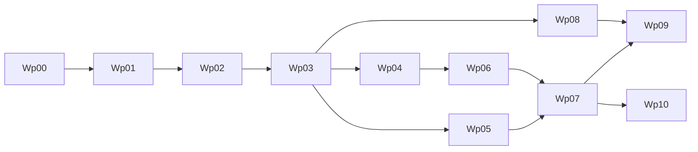

# Execution Board

Last updated: 2026-03-03

This is the single board for planning and delivery.  
All teams should update status here first, then mirror updates in role playbooks.

## How To Use

1. Check task status (`Done`, `In Progress`, `Ready`, `Blocked`, `Backlog`).
2. Confirm prerequisites are complete.
3. Take only `Ready` tasks unless explicitly escalated.
4. Update owner and date whenever task status changes.

## Status Legend

- `Done`: completed with evidence and acceptance criteria met
- `In Progress`: currently being executed
- `Ready`: unblocked and queued
- `Blocked`: cannot proceed (list blocker)
- `Backlog`: not started and not yet ready

## Milestones and Work Packages

| ID | Work Package | Owner | Support | Order | Parallelizable | Prerequisites | Status | Target Window |
|---|---|---|---|---|---|---|---|---|
| WP-00 | Foundation docs and architecture baseline | Product | Eng, QA | 0 | No | none | Done | Complete |
| WP-01 | Build/CI baseline (wrapper, CI jobs, test command) | Engineering | QA | 1 | No | WP-00 | Ready | Week 1 |
| WP-02 | Real Android runtime slice (`llama.cpp`) | Engineering | QA | 2 | No | WP-01 | Ready | Week 1-2 |
| WP-03 | Artifact + benchmark reliability (A/B thresholds) | Engineering | QA, Product | 3 | Partial | WP-02 | Ready | Week 2 |
| WP-04 | Routing, policy, diagnostics hardening | Engineering | Security, QA | 4 | Yes | WP-03 | Backlog | Week 3 |
| WP-05 | Tool runtime safety productionization | Engineering | Security, QA | 4 | Yes | WP-03 | Backlog | Week 3-4 |
| WP-06 | Memory + image productionization | Engineering | QA, Product | 5 | Partial | WP-04 | Backlog | Week 4-5 |
| WP-07 | Beta hardening and go/no-go packet | QA | Eng, Product | 6 | No | WP-05, WP-06 | Backlog | Week 6 |
| WP-08 | MVP positioning and launch prep assets | Marketing | Product | 5 | Yes | WP-03 | Backlog | Week 4-6 |
| WP-09 | Distribution plan and beta operations | Product | Marketing, QA | 6 | Yes | WP-07, WP-08 | Backlog | Week 6-7 |
| WP-10 | Voice horizon discovery (STT/TTS spikes) | Engineering | Product, QA | 7 | Yes | WP-07 | Backlog | Post-MVP |

## Current Sprint Board

### In Progress

- [ ] None

### Ready

- [ ] WP-01 Build/CI baseline
- [ ] WP-02 Real Android runtime slice
- [ ] WP-03 Artifact + benchmark reliability

### Blocked

- [ ] None

### Done

- [x] WP-00 Foundation docs and architecture baseline

## Dependency Flow

## Evidence Required Per Package

- WP-01: CI run output, test command docs
- WP-02: physical device run logs, first-token metrics
- WP-03: scenario A/B benchmark CSV + threshold report
- WP-04: routing boundary tests + diagnostics redaction checks
- WP-05: tool security regression tests
- WP-06: scenario C benchmark + memory persistence evidence
- WP-07: soak test outputs + completed go/no-go packet
- WP-08: messaging doc, competitor comparison matrix, launch page draft
- WP-09: channel plan, support process, beta rollout checklist
- WP-10: STT/TTS spike report with latency/power budgets

## Cadence

1. Weekly planning: pull from `Ready`.
2. Midweek checkpoint: blockers, risk, dependency changes.
3. Weekly review: attach evidence and move status.
