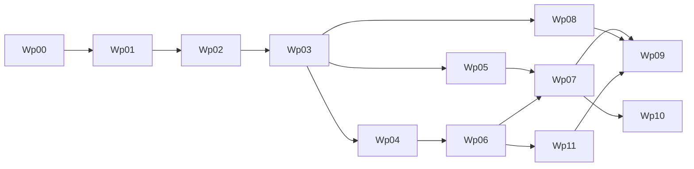

# Execution Board

Last updated: 2026-03-04

This is the single board for planning and delivery.  
All teams should update status here first, then mirror updates in role playbooks.

## How To Use

1. Check task status (`Done`, `In Progress`, `Ready`, `Blocked`, `Backlog`).
2. Confirm prerequisites are complete.
3. Take only `Ready` tasks unless explicitly escalated.
4. Update owner and date whenever task status changes.

## Status Legend

- `Done`: completed with evidence and acceptance criteria met
- `In Progress`: currently being executed
- `Ready`: unblocked and queued
- `Blocked`: cannot proceed (list blocker)
- `Backlog`: not started and not yet ready

## Milestones and Work Packages

| ID | Work Package | Owner | Support | Order | Parallelizable | Prerequisites | Status | Target Window |
|---|---|---|---|---|---|---|---|---|
| WP-00 | Foundation docs and architecture baseline | Product | Eng, QA | 0 | No | none | Done | Complete |
| WP-01 | Build/CI baseline (wrapper, CI jobs, test command) | Engineering | QA | 1 | No | WP-00 | Done | Week 1 |
| WP-02 | Real Android runtime slice (`llama.cpp`) | Engineering | QA | 2 | No | WP-01 | Done | Week 1-2 |
| WP-03 | Artifact + benchmark reliability (A/B thresholds) | Engineering | QA, Product | 3 | Partial | WP-02 | Done | Week 2 |
| WP-04 | Routing, policy, diagnostics hardening | Engineering | Security, QA | 4 | Yes | WP-03 | Done | Week 3 |
| WP-05 | Tool runtime safety productionization | Engineering | Security, QA | 4 | Yes | WP-03 | Done | Week 3-4 |
| WP-06 | Memory + image productionization | Engineering | QA, Product | 5 | Partial | WP-04 | Done | Week 4-5 |
| WP-07 | Beta hardening and go/no-go packet | QA | Eng, Product | 6 | No | WP-05, WP-06 | Done | Week 6 |
| WP-08 | MVP positioning and launch prep assets | Marketing | Product | 5 | Yes | WP-03 | Done | Week 4-6 |
| WP-09 | Distribution plan and beta operations | Product | Marketing, QA | 7 | Yes | WP-07, WP-08, WP-11 | In Progress | Week 6-7 |
| WP-10 | Voice horizon discovery (STT/TTS spikes) | Engineering | Product, QA | 8 | Yes | WP-07 | Backlog | Post-MVP |
| WP-11 | Android MVP user experience (chat + session + image/tool UX) | Engineering | Product, QA, Design | 6 | Yes | WP-06 | Done | Week 6 |

## Current Sprint Board

### In Progress

- [ ] MKT-03 launch channel test plan draft (execution now unblocked by gate closure)
- [ ] MKT-04 landing page + launch copy v1 prep draft (publish-readiness now unblocked by gate closure)
- [ ] WP-09 distribution plan and beta operations execution (kickoff note published)

### Ready

- [ ] PROD-04 monetization scope and pricing hypothesis kickoff

### Blocked

- [ ] None

### Done

- [x] WP-00 Foundation docs and architecture baseline
- [x] WP-01 Build/CI baseline
- [x] WP-02 Real Android runtime slice
- [x] QA-01 Stage 1 smoke loop on physical Android completed (`docs/operations/evidence/wp-02/2026-03-04-qa-01.md`)
- [x] WP-03 Artifact + benchmark reliability (A/B thresholds)
- [x] ENG-OPS Engineering foundations simplification (strict gates, single-source docs, Android module realignment scaffolding)
- [x] QA-02 Phase B: real Scenario A/B device run + threshold report + logcat evidence
- [x] ENG-04 closeout gate: artifact-manifest startup validation active, placeholder checksum removed from active Stage-2 path, and QA unblocked for final QA-02 rerun
- [x] QA-02 closeout rerun: artifact-validated Stage-2 Scenario A/B packet refreshed with threshold PASS + logcat (`docs/operations/evidence/wp-03/2026-03-04-qa-02-closeout.md`)
- [x] ENG-05 implementation scope landed: routing matrix tests, runtime policy enforcement checks, and diagnostics redaction checks (`docs/operations/evidence/wp-04/2026-03-04-eng-05.md`)
- [x] QA-03 routing/policy boundary regression rerun passed on incoming WP-04 state (`docs/operations/evidence/wp-04/2026-03-04-qa-03-rerun.md`)
- [x] QA-04 tool safety adversarial regression rerun passed on final WP-05 state (`docs/operations/evidence/wp-05/2026-03-04-qa-04-rerun.md`)
- [x] ENG-06 closeout gate: tool runtime schema safety productionization completed with package-level acceptance and deterministic error-contract stability checks (`docs/operations/evidence/wp-05/2026-03-04-eng-06-closeout.md`)
- [x] ENG-07 closeout gate: SQLite memory backend + retention/pruning tests + deterministic Scenario C image contract tests landed; QA-05 unblocked for device acceptance execution (`docs/operations/evidence/wp-06/2026-03-04-eng-07-closeout.md`)
- [x] QA-05 Scenario C image + memory acceptance packet executed and passed (`docs/operations/evidence/wp-06/2026-03-04-qa-05.md`)
- [x] ENG-08 closeout gate: runtime image flow integrated with routing/model lifecycle contracts plus deterministic image validation coverage (`docs/operations/evidence/wp-06/2026-03-04-eng-08.md`)
- [x] WP-06 package closeout complete (ENG-07 + ENG-08 + QA-05 evidence aligned)
- [x] WP-05 Tool runtime safety productionization package closeout complete
- [x] WP-04 package closeout complete (routing/policy/diagnostics hardening with engineering+QA evidence)
- [x] QA-06 30-minute soak and crash/OOM/ANR evidence pack executed and passed (`docs/operations/evidence/wp-07/2026-03-04-qa-06.md`)
- [x] WP-07 Engineering Stage-6 resilience support closeout landed (startup-check assessment + crash-recovery guard tests) (`docs/operations/evidence/wp-07/2026-03-04-eng-stage6-resilience-closeout.md`)
- [x] WP-07 package closeout complete (final Product/QA/Engineering dated signatures recorded) (`docs/operations/evidence/wp-07/2026-03-04-prod-03-final-signoff.md`)
- [x] WP-11 package closeout complete (Product/QA/Engineering closure signoff recorded) (`docs/operations/evidence/wp-11/2026-03-04-prod-qa-eng-wp11-closeout.md`)
- [x] PROD-03 acceptance checklist finalization complete
- [x] WP-08 positioning and launch prep asset lock pass complete (`docs/operations/evidence/wp-08/2026-03-04-mkt-lock-pass.md`, `docs/operations/evidence/wp-08/2026-03-04-prod-lock-pass.md`)

## Immediate Assignments (Current Owners)

1. Engineering (Lead/Core/Runtime):
   - WP-07 and WP-11 closure gates are signed; support WP-09 rollout readiness and stabilization backlog.
2. QA:
   - WP-07/WP-11 approvals are recorded; shift to WP-09 rollout quality checkpoints.
3. Product:
   - External beta signoff gate is clear; WP-09/PROD-06 kickoff published (`docs/operations/evidence/wp-09/2026-03-04-prod-06-kickoff.md`).
4. Marketing:
   - Advance MKT-03/MKT-04 from draft toward publish-ready assets under release sequencing.

## Evidence Log

- WP-01 (ENG-01 partial delivery): `docs/operations/evidence/wp-01/2026-03-03-eng-01.md`
- WP-01 (ENG-02 CI baseline): `docs/operations/evidence/wp-01/2026-03-03-eng-02.md`
- WP-02 (ENG-03 runtime bridge integration): `docs/operations/evidence/wp-02/2026-03-03-eng-03.md`
- WP-02 (ENG-03 automation foundation update): `docs/operations/evidence/wp-02/2026-03-03-eng-03-automation-foundation.md`
- WP-02 (ENG-03 device pass 01): `docs/operations/evidence/wp-02/2026-03-03-eng-03-device-pass-01.md`
- WP-02 (ENG-03 device pass 02, acceptance met): `docs/operations/evidence/wp-02/2026-03-03-eng-03-device-pass-02.md`
- WP-02 (QA-01 stage 1 smoke loop validation): `docs/operations/evidence/wp-02/2026-03-04-qa-01.md`
- WP-03 (QA-02 prep only): `docs/operations/evidence/wp-03/2026-03-03-qa-02-prep.md`
- WP-03 (QA-02 Phase B execution): `docs/operations/evidence/wp-03/2026-03-03-qa-02-phase-b.md`
- WP-03 (QA-02 final closeout rerun on artifact-validated path): `docs/operations/evidence/wp-03/2026-03-04-qa-02-closeout.md`
- WP-03 (ENG-04 closeout): `docs/operations/evidence/wp-03/2026-03-03-eng-04-closeout.md`
- WP-03 (ENG-OPS foundations simplification): `docs/operations/evidence/wp-03/2026-03-03-eng-ops-foundations.md`
- WP-04 (ENG-05 implementation): `docs/operations/evidence/wp-04/2026-03-04-eng-05.md`
- WP-04 (QA-03 rerun): `docs/operations/evidence/wp-04/2026-03-04-qa-03-rerun.md`
- WP-05 (ENG-06 closeout): `docs/operations/evidence/wp-05/2026-03-04-eng-06-closeout.md`
- WP-05 (QA-04 rerun): `docs/operations/evidence/wp-05/2026-03-04-qa-04-rerun.md`
- WP-06 (ENG-07 closeout): `docs/operations/evidence/wp-06/2026-03-04-eng-07-closeout.md`
- WP-06 (ENG-08 closeout): `docs/operations/evidence/wp-06/2026-03-04-eng-08.md`
- WP-06 (QA-05 acceptance): `docs/operations/evidence/wp-06/2026-03-04-qa-05.md`
- WP-07 (QA-06 soak evidence): `docs/operations/evidence/wp-07/2026-03-04-qa-06.md`
- WP-07 (Engineering Stage-6 resilience support closeout): `docs/operations/evidence/wp-07/2026-03-04-eng-stage6-resilience-closeout.md`
- WP-07 (PROD-03 final dated owner signatures + package closeout): `docs/operations/evidence/wp-07/2026-03-04-prod-03-final-signoff.md`
- WP-08 (MKT lock pass): `docs/operations/evidence/wp-08/2026-03-04-mkt-lock-pass.md`
- WP-08 (Product lock pass): `docs/operations/evidence/wp-08/2026-03-04-prod-lock-pass.md`
- WP-11 (UI foundation implementation + docs alignment): `docs/operations/evidence/wp-11/2026-03-04-eng-wp11-ui-foundation.md`
- WP-11 (Product/QA/Engineering closure signoff): `docs/operations/evidence/wp-11/2026-03-04-prod-qa-eng-wp11-closeout.md`
- WP-09 (Product Ops kickoff for distribution + beta operations): `docs/operations/evidence/wp-09/2026-03-04-prod-06-kickoff.md`

## Dependency Flow

## Evidence Required Per Package

- WP-01: CI run output, test command docs
- WP-02: physical device run logs, first-token metrics
- WP-03: scenario A/B benchmark CSV + threshold report
- WP-04: routing boundary tests + diagnostics redaction checks
- WP-05: tool security regression tests
- WP-06: scenario C benchmark + memory persistence evidence
- WP-07: soak test outputs + completed go/no-go packet
- WP-08: messaging doc, competitor comparison matrix, launch page draft
- WP-09: channel plan, support process, beta rollout checklist
- WP-10: STT/TTS spike report with latency/power budgets
- WP-11: UI acceptance suite (Compose/instrumentation/Maestro), UX evidence notes, and in-app workflow validation packet

## Cadence

1. Weekly planning: pull from `Ready`.
2. Midweek checkpoint: blockers, risk, dependency changes.
3. Weekly review: attach evidence and move status.
