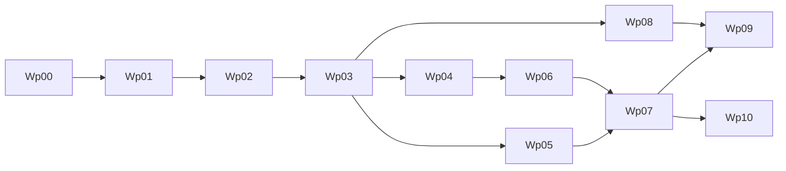

# Execution Board

Last updated: 2026-03-04

This is the single board for planning and delivery.  
All teams should update status here first, then mirror updates in role playbooks.

## How To Use

1. Check task status (`Done`, `In Progress`, `Ready`, `Blocked`, `Backlog`).
2. Confirm prerequisites are complete.
3. Take only `Ready` tasks unless explicitly escalated.
4. Update owner and date whenever task status changes.

## Status Legend

- `Done`: completed with evidence and acceptance criteria met
- `In Progress`: currently being executed
- `Ready`: unblocked and queued
- `Blocked`: cannot proceed (list blocker)
- `Backlog`: not started and not yet ready

## Milestones and Work Packages

| ID | Work Package | Owner | Support | Order | Parallelizable | Prerequisites | Status | Target Window |
|---|---|---|---|---|---|---|---|---|
| WP-00 | Foundation docs and architecture baseline | Product | Eng, QA | 0 | No | none | Done | Complete |
| WP-01 | Build/CI baseline (wrapper, CI jobs, test command) | Engineering | QA | 1 | No | WP-00 | Done | Week 1 |
| WP-02 | Real Android runtime slice (`llama.cpp`) | Engineering | QA | 2 | No | WP-01 | Done | Week 1-2 |
| WP-03 | Artifact + benchmark reliability (A/B thresholds) | Engineering | QA, Product | 3 | Partial | WP-02 | Done | Week 2 |
| WP-04 | Routing, policy, diagnostics hardening | Engineering | Security, QA | 4 | Yes | WP-03 | In Progress | Week 3 |
| WP-05 | Tool runtime safety productionization | Engineering | Security, QA | 4 | Yes | WP-03 | In Progress | Week 3-4 |
| WP-06 | Memory + image productionization | Engineering | QA, Product | 5 | Partial | WP-04 | Backlog | Week 4-5 |
| WP-07 | Beta hardening and go/no-go packet | QA | Eng, Product | 6 | No | WP-05, WP-06 | Backlog | Week 6 |
| WP-08 | MVP positioning and launch prep assets | Marketing | Product | 5 | Yes | WP-03 | In Progress | Week 4-6 |
| WP-09 | Distribution plan and beta operations | Product | Marketing, QA | 6 | Yes | WP-07, WP-08 | Backlog | Week 6-7 |
| WP-10 | Voice horizon discovery (STT/TTS spikes) | Engineering | Product, QA | 7 | Yes | WP-07 | Backlog | Post-MVP |

## Current Sprint Board

### In Progress

- [ ] WP-04 Routing, policy, diagnostics hardening
- [ ] WP-05 Tool runtime safety productionization
- [ ] ENG-06 Tool runtime strict schema validation hardening (parallel CI-first scope; no physical-device dependency)
- [ ] QA-03 routing/policy boundary regression suite (baseline execution PASS logged 2026-03-04; rerun pending incoming WP-04 deltas)
- [ ] QA-04 tool safety adversarial regression suite (baseline execution PASS logged 2026-03-04; rerun pending final WP-05 merge set)
- [ ] PROD-03 acceptance checklist finalization (aligned; final beta closeout pending Stage 5/6 evidence)
- [ ] MKT-02 competitor external sourcing pass (optional enhancement; publishable Pocket GPT claim set already locked)

### Ready

- [ ] PM/Prod dispatch for WP-04/WP-05 owner-level scope, acceptance criteria, and dependencies

### Blocked

- [ ] None

### Done

- [x] WP-00 Foundation docs and architecture baseline
- [x] WP-01 Build/CI baseline
- [x] WP-02 Real Android runtime slice
- [x] WP-03 Artifact + benchmark reliability (A/B thresholds)
- [x] ENG-OPS Engineering foundations simplification (strict gates, single-source docs, Android module realignment scaffolding)
- [x] QA-02 Phase B: real Scenario A/B device run + threshold report + logcat evidence
- [x] ENG-04 closeout gate: artifact-manifest startup validation active, placeholder checksum removed from active Stage-2 path, and QA unblocked for final QA-02 rerun
- [x] QA-02 closeout rerun: artifact-validated Stage-2 Scenario A/B packet refreshed with threshold PASS + logcat (`docs/operations/evidence/wp-03/2026-03-04-qa-02-closeout.md`)
- [x] ENG-05 implementation scope landed: routing matrix tests, runtime policy enforcement checks, and diagnostics redaction checks (`docs/operations/evidence/wp-04/2026-03-04-eng-05.md`)
- [x] PROD-01 launch workflows lock pass complete (2026-03-04)
- [x] PROD-02 launch device policy lock pass complete (2026-03-04)
- [x] MKT-01 messaging architecture lock pass complete (evidence-mapped baseline retained)
- [x] MKT-02 competitor matrix lock pass complete with claim-risk labels and dependency tags (`docs/operations/mkt-02-competitor-matrix-template-draft.md`)
- [x] WP-08 marketing lock-pass evidence note published (`docs/operations/evidence/wp-08/2026-03-04-mkt-lock-pass.md`)

## Immediate Assignments (PM Dispatch)

1. Lead Eng - start now:
   - ENG-04 gate for WP-03 is closed (`docs/operations/evidence/wp-03/2026-03-03-eng-04-closeout.md`)
   - keep ENG-06 package-close prep running in parallel (do not claim WP-05 Done yet)
2. QA - start immediately after ENG-04 closeout:
   - QA-02 closure refresh complete (`docs/operations/evidence/wp-03/2026-03-04-qa-02-closeout.md`); recommend WP-03 package close decision
   - QA-03/QA-04 baseline regression execution captured (`docs/operations/evidence/wp-04/2026-03-04-qa-03.md`, `docs/operations/evidence/wp-05/2026-03-04-qa-04.md`); rerun required on final WP-04/WP-05 merge set before package-close recommendation
3. Product - start now in draft mode, finalize after WP-03 Done:
   - `PROD-01` launch workflows finalized (lock pass complete 2026-03-04)
   - `PROD-02` launch device support policy finalized (lock pass complete 2026-03-04)
   - `PROD-03` acceptance checklist aligned to current validated scope; final beta closeout gated by Stage 5/6 evidence
4. Marketing - start now in draft mode, finalize after WP-03 Done:
   - `MKT-01` messaging architecture finalized (`docs/operations/mkt-01-messaging-architecture-draft.md`)
   - `MKT-02` evidence-safe competitor matrix finalized with validated/provisional/excluded labeling (`docs/operations/mkt-02-competitor-matrix-template-draft.md`)
   - lock-pass evidence note published (`docs/operations/evidence/wp-08/2026-03-04-mkt-lock-pass.md`)

## Evidence Log

- WP-01 (ENG-01 partial delivery): `docs/operations/evidence/wp-01/2026-03-03-eng-01.md`
- WP-01 (ENG-02 CI baseline): `docs/operations/evidence/wp-01/2026-03-03-eng-02.md`
- WP-02 (ENG-03 runtime bridge integration): `docs/operations/evidence/wp-02/2026-03-03-eng-03.md`
- WP-02 (ENG-03 automation foundation update): `docs/operations/evidence/wp-02/2026-03-03-eng-03-automation-foundation.md`
- WP-02 (ENG-03 device pass 01): `docs/operations/evidence/wp-02/2026-03-03-eng-03-device-pass-01.md`
- WP-02 (ENG-03 device pass 02, acceptance met): `docs/operations/evidence/wp-02/2026-03-03-eng-03-device-pass-02.md`
- WP-03 (QA-02 prep only): `docs/operations/evidence/wp-03/2026-03-03-qa-02-prep.md`
- WP-03 (QA-02 Phase B execution): `docs/operations/evidence/wp-03/2026-03-03-qa-02-phase-b.md`
- WP-03 (QA-02 final closeout rerun on artifact-validated path): `docs/operations/evidence/wp-03/2026-03-04-qa-02-closeout.md`
- WP-03 (ENG-04 artifact lifecycle, parallel in progress): `docs/operations/evidence/wp-03/2026-03-03-eng-04.md`
- WP-03 (ENG-04 closeout, artifact-validated startup path + QA unblock): `docs/operations/evidence/wp-03/2026-03-03-eng-04-closeout.md`
- WP-03 (ENG-OPS foundations simplification): `docs/operations/evidence/wp-03/2026-03-03-eng-ops-foundations.md`
- WP-03 (ENG devctl DX consolidation: orchestrator + Maestro/Espresso lanes): `docs/operations/evidence/wp-03/2026-03-03-eng-devctl-dx-consolidation.md`
- WP-03 (Platform governance hardening refresh + self-test coverage): `docs/operations/evidence/wp-03/2026-03-03-eng-platform-governance-refresh.md`
- WP-03 (PM post-reconciliation next-step dispatch): `docs/operations/evidence/wp-03/2026-03-03-pm-next-steps-dispatch.md`
- WP-03 (PM owner-level assignment briefs): `docs/operations/evidence/wp-03/2026-03-03-pm-owner-briefs.md`
- WP-04 (ENG-05 routing/policy/diagnostics hardening implementation): `docs/operations/evidence/wp-04/2026-03-04-eng-05.md`
- WP-04 (QA-03 routing/policy boundary regression baseline): `docs/operations/evidence/wp-04/2026-03-04-qa-03.md`
- WP-05 (ENG-06 tool schema hardening, parallel in progress): `docs/operations/evidence/wp-05/2026-03-03-eng-06.md`
- WP-05 (QA-04 tool safety adversarial regression baseline): `docs/operations/evidence/wp-05/2026-03-04-qa-04.md`
- WP-08 (Product lock pass: PROD-01/02 finalization + PROD-03 alignment): `docs/operations/evidence/wp-08/2026-03-04-prod-lock-pass.md`
- WP-08 (MKT-01 finalized messaging architecture with claim labels): `docs/operations/mkt-01-messaging-architecture-draft.md`
- WP-08 (MKT-02 evidence-safe competitor matrix with claim-risk labels): `docs/operations/mkt-02-competitor-matrix-template-draft.md`
- WP-08 (MKT lock-pass evidence note): `docs/operations/evidence/wp-08/2026-03-04-mkt-lock-pass.md`

## Dependency Flow

## Evidence Required Per Package

- WP-01: CI run output, test command docs
- WP-02: physical device run logs, first-token metrics
- WP-03: scenario A/B benchmark CSV + threshold report
- WP-04: routing boundary tests + diagnostics redaction checks
- WP-05: tool security regression tests
- WP-06: scenario C benchmark + memory persistence evidence
- WP-07: soak test outputs + completed go/no-go packet
- WP-08: messaging doc, competitor comparison matrix, launch page draft
- WP-09: channel plan, support process, beta rollout checklist
- WP-10: STT/TTS spike report with latency/power budgets

## Cadence

1. Weekly planning: pull from `Ready`.
2. Midweek checkpoint: blockers, risk, dependency changes.
3. Weekly review: attach evidence and move status.
