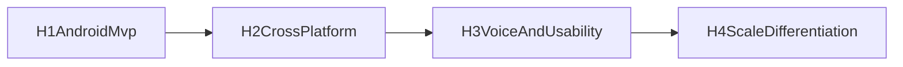

# Product Roadmap

Last updated: 2026-03-05

## Vision Anchors

1. Privacy-first, local-first assistant by default.
2. Reliable performance on real mid-tier devices.
3. Modular product/runtime architecture that can expand without breaking trust.

## Horizon Overview

| Horizon | Timeline | Primary Outcome |
|---|---|---|
| H1 | 0-2 months | Android MVP pilot and promotion decision with evidence-safe claims |
| H2 | 2-5 months | Android production hardening + iOS parity alpha |
| H3 | 5-9 months | Voice layer (STT/TTS), richer multimodal, workflow quality |
| H4 | 9-18 months | Platform expansion, premium capabilities, ecosystem/distribution scale |

## H1 Release Checkpoint (As of March 5, 2026)

| Domain | Current State | Post-MVP Done State |
|---|---|---|
| UI/UX | Core chat/session/image/tool/privacy/model setup flows implemented; deterministic error UX implemented | First-run recovery comprehension validated with moderated cohort and reduced setup friction |
| Backend/Runtime | Native JNI path, startup checks, provenance/checksum/runtime-compat gates and tool/image data paths implemented | Stable RC lanes across instrumented + Maestro + journey with no false-negative preflight failures |
| Marketing | Messaging architecture, competitor snapshot, launch drafts ready | Proof assets + first 7-day channel scorecard executed with claim-safe evidence links |
| Product/Ops | Workflow/device policy/go-no-go framework in place; WP-13 still open | Single launch gate matrix governs promote/hold with explicit pilot thresholds |

## H1 Active Gaps

1. Moderated 5-user usability metrics and qualitative packet completion.
2. Stable lane behavior under device preflight edge cases.
3. Explicit timeout/cancel recovery UX parity across product docs and evidence packets.
4. Weekly required-tier + best-effort physical-device coverage consistency.
5. Executed channel scorecard data (beyond template readiness).
6. Timeline/status alignment across roadmap and operations docs.

## H1 Decision Policies

1. Build policy: single-build downloads by default.
2. Gate policy: `soft gate` for pilot expansion only.
3. Default pilot window: 25 testers for 7 days.
4. Broad promotion requires completed moderated packet + launch gate matrix review.

## H2: Cross-Platform and Reliability

Scope:

1. iOS runtime slice and parity backlog.
2. Full production model lifecycle controls (download, verify, version, eviction).
3. Privacy-control depth expansion (retention reset, per-tool controls, policy surfacing).
4. Shared module contract hardening across Android and iOS.

## H3: Voice and Usability Expansion

Scope:

1. STT input path and voice conversation mode.
2. TTS output mode with latency/power constraints.
3. Better memory quality and context shaping.
4. Confidence signaling and multimodal quality upgrades.

## H4: Scale and Differentiation

Scope:

1. Advanced bounded workflows.
2. Premium model tiers by device capability.
3. Distribution expansion and partnerships.
4. Optional sync/backup with explicit opt-in boundaries.

## Dependency Flow

