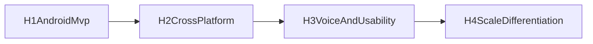

# Product Roadmap

Last updated: 2026-03-03

## Vision Anchors

1. Privacy-first, local-first assistant by default
2. Reliable performance on real mid-tier devices
3. Modular product and runtime architecture that scales to iOS and advanced features

## Horizon Overview

| Horizon | Timeline | Primary Outcome |
|---|---|---|
| H1 | 0-2 months | Android MVP beta candidate validated on physical devices |
| H2 | 2-5 months | Android production hardening + iOS parity alpha |
| H3 | 5-9 months | Voice layer (STT/TTS), richer multimodal, workflow quality |
| H4 | 9-18 months | Platform expansion, premium capabilities, ecosystem/distribution scale |

## H1: Android MVP (Now)

Scope:

1. Offline text chat with streaming output
2. Single-image/document-photo understanding
3. 3-5 local deterministic tools
4. Memory v1 (bounded retrieval + retention policy)
5. Evidence-driven benchmark and go/no-go process

Exit criteria:

1. Scenario A/B/C thresholds met on target Android mid-tier devices
2. No repeatable blocker OOM/ANR in soak tests
3. Privacy controls and policy gates verified by tests and evidence

## H2: Cross-Platform and Reliability

Scope:

1. iOS runtime slice and parity backlog
2. Productionization of model artifact lifecycle (download, verify, version, eviction)
3. SQLite memory backend + migration paths
4. Tool schema hardening and policy integration with platform networking

Exit criteria:

1. Android production RC quality bar met
2. iOS alpha slice running same core scenarios
3. Shared module contracts remain stable across both apps

## H3: Voice and Usability Expansion

Scope:

1. **TTS support** (offline-first where possible, policy-gated fallback if needed)
2. STT input path and voice conversation mode
3. Better memory quality and context shaping
4. Image quality/rubric upgrades and user-facing confidence indicators

Exit criteria:

1. End-to-end voice roundtrip (STT -> inference -> TTS) meets latency targets
2. Voice mode passes privacy controls equivalent to text mode
3. Battery/thermal overhead stays within acceptable mobile limits

## H4: Scale and Differentiation

Scope:

1. Advanced workflows (multi-step but bounded automation)
2. Premium model tiers for capable devices
3. Distribution expansion (OEM channels, privacy-focused partnerships, developer community)
4. Optional sync/backup features with explicit user opt-in and clear data boundaries

Exit criteria:

1. Sustainable retention and conversion metrics
2. Stable operational quality at broader device coverage
3. Defensible differentiation in privacy + reliability + utility

## Dependency Flow

## 30-60-90 Day Operating Plan

### Next 30 Days

1. Complete Stage 0-2 from `docs/roadmap/next-steps-execution-plan.md`.
2. Run first physical Android benchmark evidence cycle.
3. Lock launch device tier support matrix.

### Day 31-60

1. Complete Stage 3-5 hardening and feature closure.
2. Validate security/privacy gates with evidence artifacts.
3. Prepare beta go/no-go packet.

### Day 61-90

1. Execute Stage 6 soak and decision.
2. Start iOS parity alpha planning.
3. Define voice (STT/TTS) technical spike scope and success metrics.
