# Screenshot Reference Gallery (`sm-a515f-android13`)

- Updated: `2026-03-06T22:40:39`
- Source: `scripts/benchmarks/runs/2026-03-06/adb-RR8NB087YTF-P4Pfzs._adb-tls-connect._tcp/screenshot-pack/20260306-222847/combined`

## ui-01-onboarding-page-1

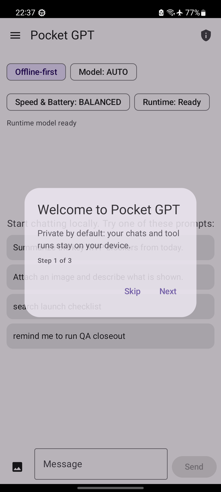

## ui-02-onboarding-page-2

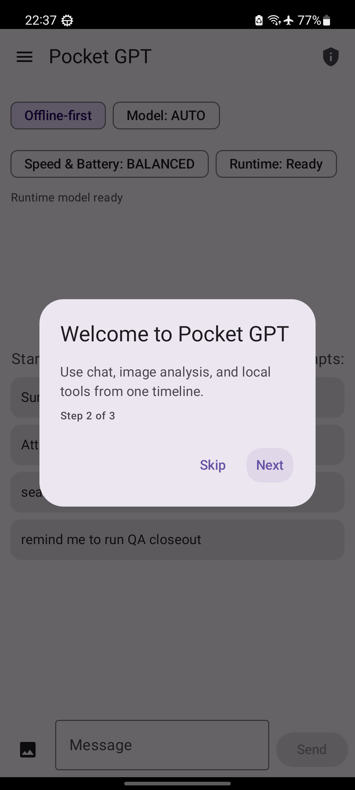

## ui-03-onboarding-page-3

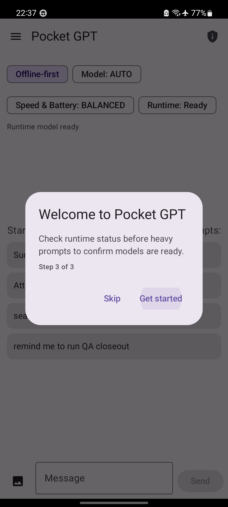

## ui-04-chat-ready-empty

## ui-05-chat-post-send

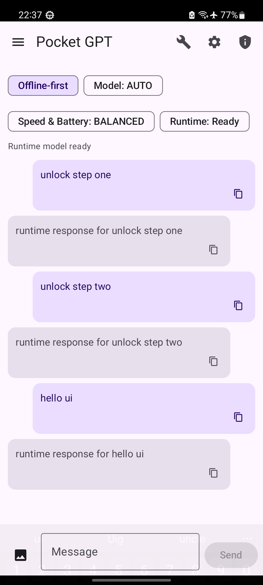

## ui-06-session-drawer

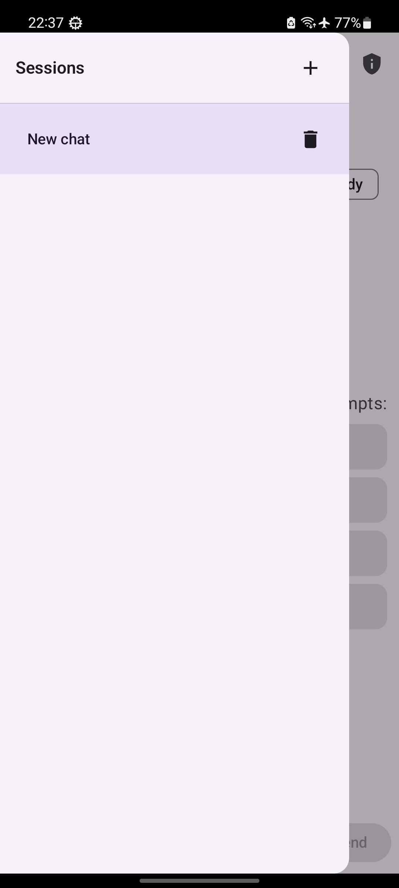

## ui-07-privacy-sheet

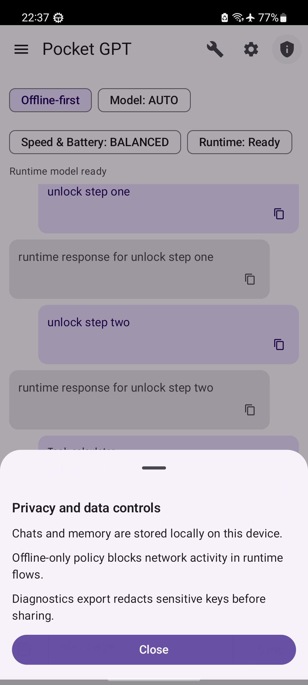

## ui-08-tools-dialog

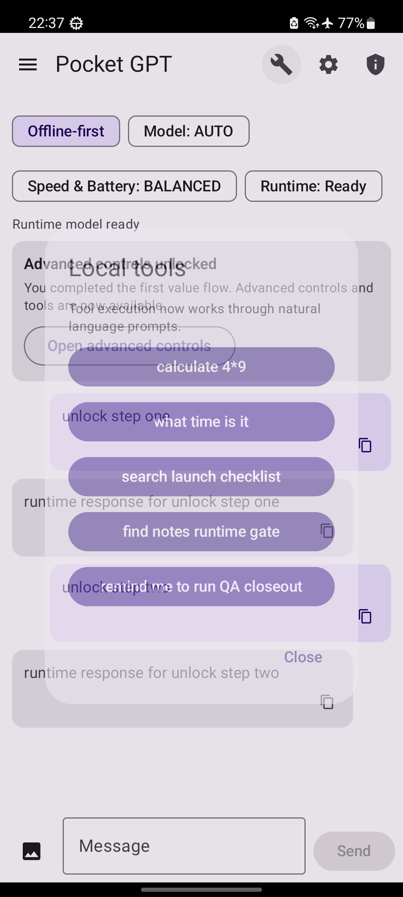

## ui-09-advanced-controls-sheet

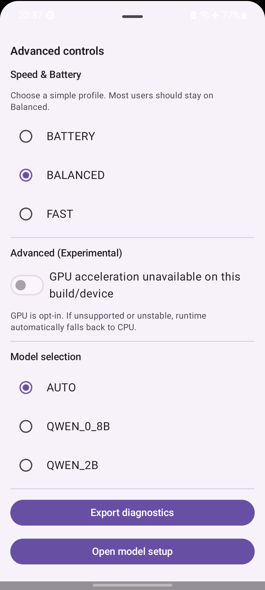

## ui-10-model-provisioning-sheet

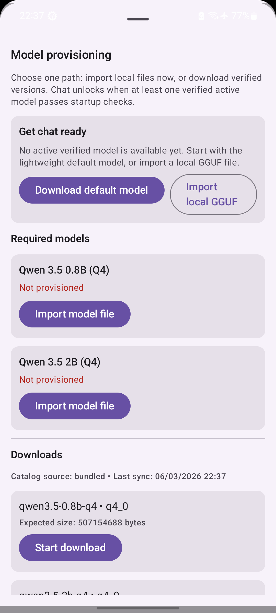

## ui-11-advanced-unlock-cue

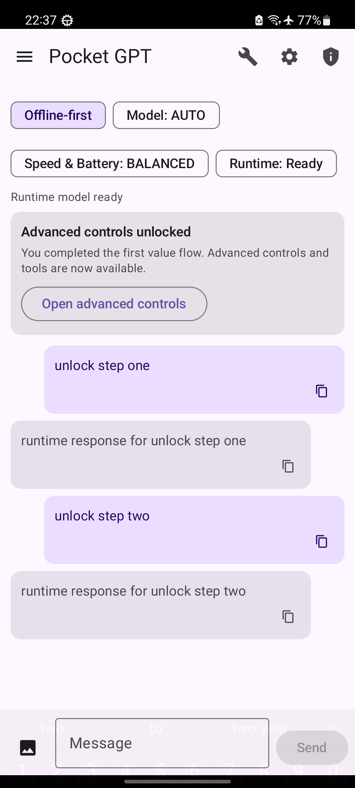

## ui-12-runtime-loading

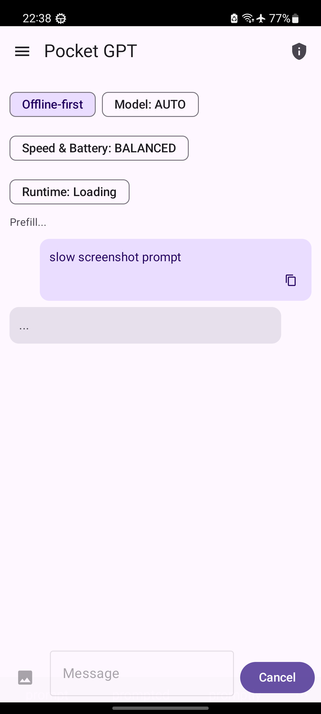

## ui-13-runtime-error-ui-runtime-001

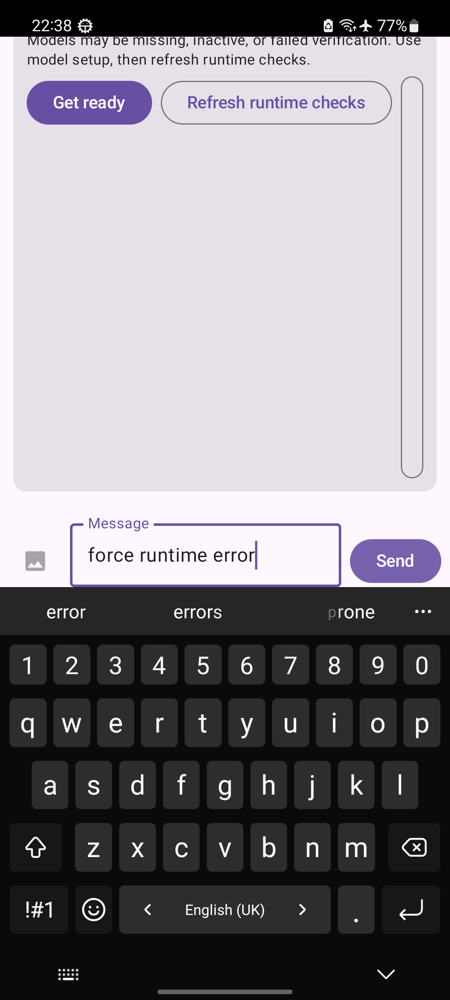

## ui-14-tool-result-visible

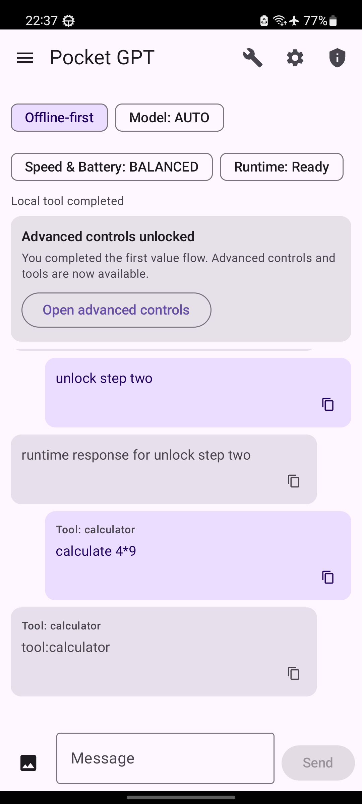

## ui-15-image-entry-visible

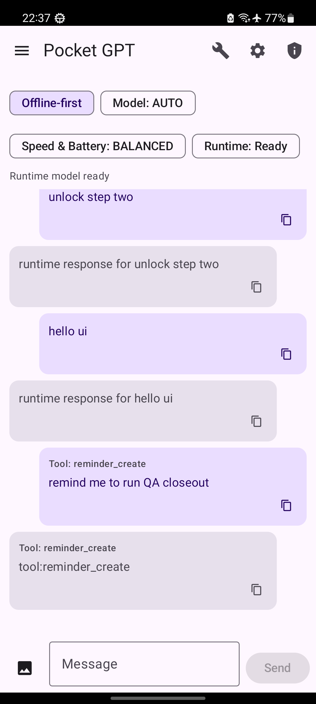
